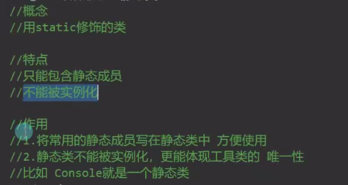
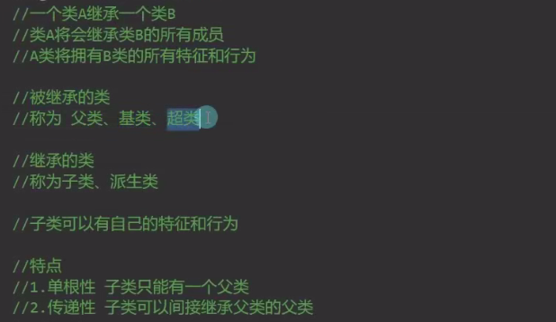

# 变长数据类型 和默认参数

1.params：后跟数组 写在最后面  一个函数只能有一个

2.默认参数：可能有多个   写在最后

```C#
internal class Program
    {
        // 可变参数
        static void add( params int[] a)
        {
            int sum = 0;
            foreach (int i in a)
            {
                sum += i;
            }
            Console.WriteLine(sum);
        }
        // 默认参数
        static void print(string a = "hello",string b = "world")
        {
            Console.WriteLine(a + " " + b);
        }
        static void Main(string[] args)
        {
            //add(1, 2, 3, 4, 5);
            print();
            print( "a","b");
        }
    }
```


# 面向对象的基本概念

万物皆对象

# 成员变量和访问修饰符


  结构体的成员变量不能再结构体内赋值，类可以

不能在类中实例化一个自己相同类型的成员变量     如果要声明了不能实例化

# 构造函数，析构函数，垃圾回收

1.类中允许申明自己的无参数构造函数（类中不申明时，自动创建一个无参数构造函数）

当声明了有参数的构造函数时，无参数的构造函数自动隐去

   结构体申明构造函数的时候不允许申明无参数的构造函数          ---C#10更新后支持   且不会隐去默认的无参构造函数

2.调用其他的构造函数


# 成员属性

1.属性中可以添加逻辑处理和加密处理来实现保护成员变量

2.加密  set 的时候加密 	get的时候解密

3.	// 注意

​        //1.默认不加 会使用属性申明时的访问权限
        //2.加的访问修饰符要低于属性的访问权限
        //3.不能让get和set的访问权限都低于属性的权限、

4.

```c#
string Name
        {
            get
            {
                return _Name;
            }
        }
        
//同理：Set 
```

使属性只能读或者只能改

5.自动属性

```C#
public string Name
        {
            private get;
            set;
        }
```

# 索引器

总结：

//总结
        //索引器对于我们来说的主要作用
        //可以让我们以中括号的形式范围自定义类中的元素 规则自己定 访问时和数组一样
        //比较适用于 在类中有数组变量时使用 可以方便的访问和进行逻辑处理
        //固定写法
        //访问修饰符 返回值 this[参数列表]
        //get和set语句块
        //可以重载
        //注意:结构体里面也是支持索引器

# 静态成员

1.静态成员的特点
            //程序开始运行时 就会分配内存空间。所以我们就能直接使用,
            //静态成员和程序同生共死
            //只要使用了它，直到程序结束时内存空间才会被释放
            //所以一个静态成员就会有自己唯一的一个“内存小房间”
            //这让静态成员就有了唯一性
            //在任何地方使用都是用的小房间里的内容，改变了它也是改变小房间里的内容.

2.静态函数中不能使用非静态成员（会报错）

​    非静态函数可以使用静态成员                    ---->生命周期的影响   静态的开始时就存在  不需要实例化

3.常量和静态

//const(常量)可以理解为特殊的static(静态)

//相同点
//他们都可以通过类名点出使用
//不同点
//1.const必须初始化，不能修改 static没有这个规则
//2.const只能修饰变量、static可以修饰很多
//3.const一定是写在访问修饰符后面的，static没有这个要求


# 静态类和静态构造函数

1.静态类



2.静态构造函数


静态构造函数无论是在静态类中还是在普通类中都只在类第一次使用的时候调用一次

# 拓展方法

//概念
//为现有非静态 变量类型 添加 新方法

//作用
//1.提升程序拓展性
//2.不需要再对象中重新写方法

//3.不需要继承来添加方法

//4.为别人封装的类型写额外的方法
//特点
//1.一定是写在静态类中

//2.一定是个静态函数
//3.第一个参数为拓展目标

//4.第一个参数用this修饰

```C#
namespace 拓展方法
{
    public static class Tool
    {
        public static void Print(this string str)   //为string添加拓展方法  string无法更改 在任意一个静态类中添加拓展方法
            //如果拓展方法的方法名和原类中的方法名一样执行原来类中的方法
        {
         Console.WriteLine("这是拓展方法");
        }
    }

    internal class Program
    {
        static void Main(string[] args)
        {
            Console.WriteLine("Hello, World!");
            string s = "sdsa";
            s.Print();
        }
    }
}
```

# 运算符重载

概念

​        让自定义类和结构体能够使用运算符

​        使用关键字 operator

​        特点

​        1.一定是一个公共的静态方法

​        2.返回值写在operator前

​        3.逻辑处理自定义

​        作用

​        让自定义类和结构体对象可以进行运算

​        注意

​        1.条件运算符需要成对实现

​        2.一个符号可以多个重载

​        3.不能使用ref和out

```C#
namespace 运算符重载
{
    class Point
    {
        public int x;
        public int y;
        public static Point operator + (Point a, Point b)  //必须有一个是包含的类(例中是Point)
        {
            Point p = new Point();
            p.x = a.x + b.x;
            p.y = a.y + b.y;
            return p;
        }
        public Point(int x, int y)
        {
            this.x = x;
            this.y = y;
        }
        Point ()
        {
            x = 0;
            y = 0;
        }
    }
    internal class Program
    {
        static void Main(string[] args)
        {
            Point a = new Point(1,3);
            Point b = new Point(2,6);
            Point c = a + b;
            Console.WriteLine("{0},{1}",c.x,c.y);
        }
    }
}
```

可重载的运算符:算术运算符:都可以，逻辑运算符：！，位运算符：基本都可以，条件运算符：基本都可以，需要成对重载

不可重载:"&&","||","[]","()",".","?  :"(三目运算符)

# 内部类(不重要)

1.定义： 一个类的内部再申明一个类

2.特点：使用时要用包裹的类点出自己

3.作用：亲密关系的体现

4.注意：访问修饰符的作用很大

```C#
namespace 内部类和分部类
{
    internal class Program
    {
        public class People
        {
            public int Id { get; set; }
            public string Name { get; set; }
            public Body body;
            public class Body
            {
                  Arm LeftArm;
                  Arm RightArm;
                 public class Arm
                {
                    public int Id { get; set; }
                    public string Name { get; set; }
                }
            }
        }
        static void Main(string[] args)
        {
            People people = new People();
            People.Body body= new People.Body();
            people.body = body;
            People.Body.Arm arm = new People.Body.Arm();
        }
    }
}
```

# 分部类

//概念
//把一个类分成几部分申明
//关键字

//partial
//作用

//分部描述一个类

//增加程序的拓展性
//注意
//分部类可以写在多个脚本文件中

//分部类的访问修饰符要一致

//分部类中不能有重复成员

```C#
namespace 内部类和分部类
{
    public partial class PartialClass
    {
        public int a;
        public void test1()
        {
            Console.WriteLine("test1");
        }
        partial void Speak();   //分部方法
       
    }
    
    public partial class PartialClass
    {
        public int b;
        public void test2()
        {
            Console.WriteLine("test2");
        }
        partial void Speak()
        {
            Console.WriteLine("Speak");
        }
    }
}
```

# 继承

1.

2.子类和父类同名的成员和函数

隐藏父类成员和函数   省略了new关键字-----覆盖父类的方法

# 里氏替换原则

1.

2.


3.使用

```c#
 public class Gameobject
    {
    }
    public class Player : Gameobject
    {
        public void test()
        {
            Console.WriteLine("这是玩家");
        }
    }


    public class Boss: Gameobject
    {
        public void test()
        {
            Console.WriteLine("这是boss");
        }
    }
    internal class Program
    {
        static void Main(string[] args)
        {
     
            Gameobject[] gameobjects = { new Player(),new Player(),new Boss()}; //Gameobject是一个容器，可以存放子类对象的实例
            for(int i = 0;i<gameobjects.Length;i++)
            {
                if (gameobjects[i] is Player)
                {

                    (gameobjects[i] as Player).test();
                }
                else if (gameobjects[i] is Boss)
                {

                    (gameobjects[i] as Boss).test();
                }

            }
            Console.WriteLine("Hello, World!");
        }
    }
```

# 继承中的构造函数

1.2.父类的无参构造函数很重要

​        子类实例化时 默认自动调用的 是父类的无参构造 所以如果父类无参构造被顶掉 会报错

可以通过base来调用父类重载的其他构造函数      但是父类一定要有子类相同的构造函数

```C#
public class Father
    {
        int a;
        int b;
        public Father()
        {
            Console.WriteLine("Father");
        }
        public Father(int a, int b)
        {
            Console.WriteLine("Father");
            this.a = a;
            this.b = b;
        }
        public Father(int a)
        {
            Console.WriteLine("Father");
            this.a = a;
        }

    }

    public class Son : Father
    {
        public Son()
        {
            Console.WriteLine("Son");
        }
        public Son(int a, int b) : base(a, b)
        {
            Console.WriteLine("Son");
        }
        public Son(int a) : base(a)
        {
            Console.WriteLine("Son");
        }
    }
```

# 多态vob

一.多态的概念
    // 多态按字面的意思就是“多种状态”
    // 让继承同一父类的子类们 在执行相同方法时有不同的表现(状态）
    // 主要目的
    // 同一父类的对象 执行相同行为(方法)有不同的表现
    //解决的问题
    //让同一个对象有唯一行为的特征

二.多态的实现
    //编译时的多态  函数重载

  //运行时多态 vob
//虚函数   virtual
//重写 override 
//父类（基类）base


三.实现

```C#
namespace 多态vob
{ 
    public class Father
    {
       public virtual void Show()
        {
            Console.WriteLine("我是一个父亲");
        }       
    }

    public class Son:Father
    {
        public override  void Show()
        { 
            Console.WriteLine("我是一个儿子");
        }
    }
    internal class Program
    {
        static void Main(string[] args)
        {
             Father father = new Son();
            father.Show();
            (father as Son).Show();  // 不使用虚函数和重写---两种行为   使用虚函数和重写  --一种行为
        }
    }
}
```


# 密封类		sealed

一 .无法被继承

二.密封方法的概念
    //用密封关键字sealed 修饰的重写函数
    //作用:让虚方法或者抽象方法之后不能再被重写
    //特点:和override一起出现

# 抽象类和抽象方法

一 .抽象类

概念：被抽象关键字abstract修饰的类
    特点： 
        1.不能被实例化
        2.可以包含抽象方法
        3.继承抽象类必须重写抽象方法

二.抽象方法

​    //又叫 纯虚方法
    //用 abstract关键字修饰的方法
    //特点:
    //1.只能在抽象类中申明
    //2.没有方法体
    //3.不能是私有的    要能够被子类重写---可以是public 和 protected
    //4.继承后必须实现 用override重写

# 接口

一. 接口申明的规范
    //1.不包含成员变量
    //2.只包含方法、属性、索引器、事件
    //3.成员不能被实现
    //4.成员可以不用写访问修饰符，不能是私有的   默认为 public
    //5.接口不能继承类，但是可以继承另一个接口

二.特点:
    //1.它和类的申明类似
    //2.接口是用来继承的
    //3.接口不能被实例化，但是可以作为容器存储对象

三.接口的使用
    //接口用来继承       接口表示行为的关系

//1.类可以继承1个类，n个接口
//2.继承了接口后 必须实现其中的内容 并且必须是public的
//3.实现的接口函数，可以加virtual再在子类重写
//4.接口也遵循里氏替换原则

四.接口可以继承接口
    //接口继承接口时   不需要实现
    //待类继承接口后   类自己去实现所有内容   实现该接口，该接口父亲接口的所有内容

五.显示实现接口
    //当一个类继承两个接口
    //但是接口中存在着同名方法时
    //注意:显示实现接口时 不能写访问修饰符


```C#
    //显示的实现接口,分别实现  使用的时候要注意确定使用的函数是哪个接口
    void I3.Fly()
    {
        throw new NotImplementedException();
    }
    void I2.Fly()
    {
        throw new NotImplementedException();
    }
    public void Fly()  //已显示实现接口，此时的Fly为类自己的FLy  可以通过；类实例化的对象.Fly()调用
    {

    }
}
```
#  string和StringBulider


# 抽象类和接口的区别

1.相同点：

1.都可以被继承	2.都不能直接实例化	3.都可以包含方法申明!		4.子类必须实现未实现的方法	5.都遵循里氏替换原则

2.区别：

1.抽象类中可以有构造函数;接口中不能  	2.抽象类只能被单一继承;接口可以被继承多个 		3.抽象类中可以有成员变量:接口不能	4.抽象类中可以申明成员方法，虚方法，抽象方法，静态方法;接口中只能申明没有实现的抽象方法		5.抽象类方法可以使用访问修饰符:接口中建议不写，默认public

3.如何选择抽象类和接口

表示对象的用抽象类，表示行为拓展的用接口															不同对象拥有的共同行为，我们往往可以使用接口来实现													举个例子:
动物是一类对象，我们自然会选择抽象类;而飞翔是一个行为，我们自然会选择接口

# 结构体和类的区别

```C#
#region 区别概述
            //结构体和类最大的区别是在存储空间上，结构体存储在栈上，类存储在堆上。一个是值类型，一个是引用类型。
            //分别对应值类型和引用类型的相应特点  赋值,传递,声明.. 

            //结构体和类在使用上很类似,结构体甚至可以用面向对象的思想去总结一类对象
            //结构体具备面向对象思想中的封装特性，但是不具备其他特性
            //由于结构体不具备继承特性，所以它不能使用protected 修饰符
            #endregion

            #region 细节区别
            //1.结构体是值类型，类是引用类型
            //2.结构体存在栈中，类存在堆中
            //3.结构体成员不能使用protected访问修饰符，而类可以
            //4.结构体成员变量申明不能指定初始值，而类可以   如果结构体成变量声明时候进行了初始化，会报错，如果实现了结构体的构造函数就不错了
            //6.结构体申明有参构造函数后，无参构造不会被顶掉
            //7.结构体不能申明析构函数，而类可以
            //8.结构体不能被继承，而类可以
            //9.结构体需要在构造函数中初始化所有成员变量，而类随意
            //10.结构体不能被静态static修饰(不存在静态结构体)，而类可以   结构体中可以有静态static成员变量
            //11.结构体不能在自己内部申明和自己一样的结构体变量，而类可以
            #endregion

            #region 结构体的特别之处
            //结构体可以继承接口   因为接口是行为的抽象
            #endregion

            #region 如何选择
            //1.想要用继承和多态时，直接淘汰结构体，比如玩家、怪物等等
            //2.对象是数据集合时，优先考虑结构体，比如位置、坐标等等
            //3.从值类型和引用类型赋值时的区别上去考虑，比如经常被赋值传递的对象，并且
            //改变赋值对象，原对象不想跟着变化时，就用结构体。比如坐标、向量、旋转等等
            #endregion
```


# UML类图

1.什么是uml


# 面向对象的七大原则

1.目标

高内聚，低耦合  	 	使程序模块的可重用性，移植性增强

2.高内聚低耦合

​      （1）从类角度来看， 高内聚低耦合:  减少类内部，对其他类的调用

​      （2）从功能块来看 高内聚低耦合:      减少模块之间的交互复杂度 

3.七大原则：

单一职责原则		开闭原则		里氏替换原则		依赖倒转原则		迪米特法则

接口隔离原则		合成复用原则

